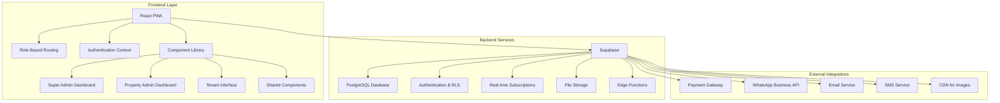
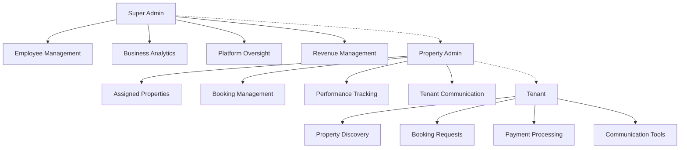

# Design Document

## Overview

NyumbaLink is a comprehensive web application built with a modern React-based frontend and Supabase backend, designed to facilitate property management through a structured employee system. The platform operates with three distinct user roles: Super Admins (platform operators), Property Admins (company employees), and Tenants (property seekers). The design emphasizes mobile-first responsive design, employee management capabilities, automated service fee processing with a 20% commission model, and comprehensive business analytics.

### Key Design Principles

- **Employee-Centric Architecture**: Built around company employee management with clear role hierarchies
- **Commission-Based Revenue Model**: Automated 20% service fee collection and distribution
- **Mobile-First PWA Design**: Progressive Web App with native app-like experience
- **Performance-Oriented**: Sub-3-second page loads with optimized asset delivery
- **Security-First**: Role-based access control with comprehensive audit trails
- **Scalable Architecture**: Support for multiple admins managing thousands of properties

## Architecture

### High-Level System Architecture



### Technology Stack

- **Frontend Framework**: React 18 with TypeScript for type safety
- **Build Tool**: Vite for fast development and optimized production builds
- **UI Framework**: Tailwind CSS with Shadcn/ui component library
- **Icons**: Lucide React for consistent iconography
- **Routing**: React Router DOM with role-based route protection
- **Backend**: Supabase (PostgreSQL, Authentication, Real-time, Storage, Edge Functions)
- **Payment Processing**: Stripe or local payment gateway integration
- **Communication**: WhatsApp Business API for direct messaging
- **PWA**: Service workers for offline functionality and app-like experience

### User Role Architecture



## Components and Interfaces

### Core Component Structure

```
src/
├── components/
│   ├── auth/
│   │   ├── AuthModal.tsx           # Role-based authentication
│   │   ├── RoleSelector.tsx        # User role selection
│   │   └── ProtectedRoute.tsx      # Route protection by role
│   ├── super-admin/
│   │   ├── EmployeeManagement.tsx  # Admin employee CRUD
│   │   ├── BusinessAnalytics.tsx   # Revenue and performance analytics
│   │   ├── PropertyAssignment.tsx  # Assign properties to admins
│   │   └── PlatformOverview.tsx    # System-wide metrics
│   ├── property-admin/
│   │   ├── PropertyManagement.tsx  # Assigned property management
│   │   ├── BookingManagement.tsx   # Handle booking requests
│   │   ├── PerformanceMetrics.tsx  # Admin KPI dashboard
│   │   └── PropertyForm.tsx        # Property creation/editing
│   ├── tenant/
│   │   ├── PropertyBrowser.tsx     # Property discovery interface
│   │   ├── PropertyDetails.tsx     # Detailed property view
│   │   ├── BookingRequest.tsx      # Viewing request form
│   │   ├── PaymentProcessor.tsx    # Service fee payment handling
│   │   └── SavedProperties.tsx     # Favorites management
│   ├── shared/
│   │   ├── Header.tsx              # Role-aware navigation
│   │   ├── NotificationCenter.tsx  # Real-time notifications
│   │   ├── SearchFilters.tsx       # Advanced property filtering
│   │   ├── PropertyCard.tsx        # Property listing card
│   │   ├── ImageGallery.tsx        # Property image management
│   │   ├── CommunicationHub.tsx    # WhatsApp/messaging integration
│   │   └── PaymentBreakdown.tsx    # Service fee display
│   └── ui/                         # Shadcn/ui components
├── pages/
│   ├── SuperAdminDashboard.tsx     # Super admin main interface
│   ├── PropertyAdminDashboard.tsx  # Property admin main interface
│   ├── TenantDashboard.tsx         # Tenant main interface
│   └── PropertyDetailsPage.tsx     # Standalone property view
├── contexts/
│   ├── AuthContext.tsx             # Role-based authentication
│   ├── NotificationContext.tsx     # Real-time notifications
│   └── PaymentContext.tsx          # Payment processing state
├── hooks/
│   ├── useEmployeeManagement.tsx   # Super admin employee operations
│   ├── usePropertyManagement.tsx   # Property admin operations
│   ├── useBookingManagement.tsx    # Booking workflow management
│   └── usePaymentProcessing.tsx    # Payment and service fee handling
└── lib/
    ├── supabase.ts                 # Supabase client configuration
    ├── payment.ts                  # Payment gateway integration
    ├── whatsapp.ts                 # WhatsApp Business API
    └── analytics.ts                # Business analytics utilities
```

### Component Interface Design

#### Super Admin Employee Management

```typescript
interface EmployeeManagementProps {
  employees: PropertyAdmin[];
  onCreateEmployee: (employeeData: CreateEmployeeData) => Promise<void>;
  onAssignProperties: (adminId: string, propertyIds: string[]) => Promise<void>;
  onDeactivateEmployee: (adminId: string) => Promise<void>;
  performanceMetrics: EmployeePerformanceMetrics[];
}
```

#### Property Admin Dashboard

```typescript
interface PropertyAdminDashboardProps {
  assignedProperties: Property[];
  bookingRequests: BookingRequest[];
  performanceMetrics: AdminKPIMetrics;
  onUpdateProperty: (
    propertyId: string,
    updates: PropertyUpdate
  ) => Promise<void>;
  onHandleBooking: (bookingId: string, action: BookingAction) => Promise<void>;
}
```

#### Payment Processing Component

```typescript
interface PaymentProcessorProps {
  rentAmount: number;
  serviceFeePercentage: number;
  propertyId: string;
  tenantId: string;
  onPaymentSuccess: (paymentData: PaymentResult) => void;
  onPaymentFailure: (error: PaymentError) => void;
}
```

## Data Models

### Enhanced Database Schema Design

#### Users Table (Extended)

```sql
CREATE TABLE users (
  id UUID REFERENCES auth.users(id) PRIMARY KEY,
  full_name TEXT NOT NULL,
  email TEXT UNIQUE NOT NULL,
  phone_number TEXT,
  user_role TEXT CHECK (user_role IN ('super_admin', 'property_admin', 'tenant')) NOT NULL,
  avatar_url TEXT,
  is_verified BOOLEAN DEFAULT FALSE,
  is_active BOOLEAN DEFAULT TRUE,
  employee_id TEXT UNIQUE, -- For property admins
  hired_date TIMESTAMP WITH TIME ZONE, -- For property admins
  performance_rating DECIMAL(3,2), -- For property admins
  created_at TIMESTAMP WITH TIME ZONE DEFAULT NOW(),
  updated_at TIMESTAMP WITH TIME ZONE DEFAULT NOW()
);
```

#### Properties Table (Enhanced)

```sql
CREATE TABLE properties (
  id UUID DEFAULT gen_random_uuid() PRIMARY KEY,
  assigned_admin_id UUID REFERENCES users(id) NOT NULL, -- Property admin assignment
  title TEXT NOT NULL,
  description TEXT NOT NULL,
  property_type TEXT CHECK (property_type IN ('house', 'apartment', 'room', 'studio')) NOT NULL,
  bedrooms INTEGER NOT NULL CHECK (bedrooms >= 0),
  bathrooms INTEGER NOT NULL CHECK (bathrooms >= 0),
  square_footage DECIMAL(10,2),
  rent_amount DECIMAL(12,2) NOT NULL CHECK (rent_amount > 0),
  service_fee_amount DECIMAL(12,2) GENERATED ALWAYS AS (rent_amount * 0.20) STORED,
  total_amount DECIMAL(12,2) GENERATED ALWAYS AS (rent_amount * 1.20) STORED,
  city TEXT NOT NULL,
  area TEXT NOT NULL,
  full_address TEXT,
  contact_preferences JSONB DEFAULT '{"whatsapp": true, "phone": true, "email": false}',
  utilities JSONB DEFAULT '{"water": false, "electricity": false, "internet": false}',
  images TEXT[] DEFAULT '{}',
  amenities TEXT[] DEFAULT '{}',
  pet_policy TEXT,
  parking_available BOOLEAN DEFAULT FALSE,
  is_available BOOLEAN DEFAULT TRUE,
  views_count INTEGER DEFAULT 0,
  inquiries_count INTEGER DEFAULT 0,
  bookings_count INTEGER DEFAULT 0,
  occupancy_rate DECIMAL(5,2) DEFAULT 0,
  created_at TIMESTAMP WITH TIME ZONE DEFAULT NOW(),
  updated_at TIMESTAMP WITH TIME ZONE DEFAULT NOW()
);
```

#### Booking Requests Table

```sql
CREATE TABLE booking_requests (
  id UUID DEFAULT gen_random_uuid() PRIMARY KEY,
  property_id UUID REFERENCES properties(id) ON DELETE CASCADE,
  tenant_id UUID REFERENCES users(id) ON DELETE CASCADE,
  admin_id UUID REFERENCES users(id) NOT NULL, -- Property admin handling the booking
  tenant_name TEXT NOT NULL,
  tenant_phone TEXT NOT NULL,
  tenant_email TEXT NOT NULL,
  preferred_viewing_date DATE NOT NULL,
  preferred_viewing_time TIME NOT NULL,
  message TEXT,
  status TEXT CHECK (status IN ('pending', 'approved', 'declined', 'completed', 'cancelled')) DEFAULT 'pending',
  admin_response TEXT,
  scheduled_date TIMESTAMP WITH TIME ZONE,
  feedback_rating INTEGER CHECK (feedback_rating >= 1 AND feedback_rating <= 5),
  feedback_comment TEXT,
  created_at TIMESTAMP WITH TIME ZONE DEFAULT NOW(),
  updated_at TIMESTAMP WITH TIME ZONE DEFAULT NOW()
);
```

#### Payments Table

```sql
CREATE TABLE payments (
  id UUID DEFAULT gen_random_uuid() PRIMARY KEY,
  booking_id UUID REFERENCES booking_requests(id) ON DELETE CASCADE,
  property_id UUID REFERENCES properties(id) NOT NULL,
  tenant_id UUID REFERENCES users(id) NOT NULL,
  admin_id UUID REFERENCES users(id) NOT NULL,
  rent_amount DECIMAL(12,2) NOT NULL,
  service_fee_amount DECIMAL(12,2) NOT NULL,
  total_amount DECIMAL(12,2) NOT NULL,
  payment_method TEXT NOT NULL,
  payment_gateway_id TEXT,
  transaction_reference TEXT UNIQUE,
  status TEXT CHECK (status IN ('pending', 'processing', 'completed', 'failed', 'refunded')) DEFAULT 'pending',
  gateway_response JSONB,
  processed_at TIMESTAMP WITH TIME ZONE,
  created_at TIMESTAMP WITH TIME ZONE DEFAULT NOW()
);
```

#### Employee Performance Tracking

```sql
CREATE TABLE employee_performance (
  id UUID DEFAULT gen_random_uuid() PRIMARY KEY,
  admin_id UUID REFERENCES users(id) ON DELETE CASCADE,
  month_year DATE NOT NULL, -- First day of the month
  properties_managed INTEGER DEFAULT 0,
  bookings_received INTEGER DEFAULT 0,
  bookings_approved INTEGER DEFAULT 0,
  bookings_completed INTEGER DEFAULT 0,
  conversion_rate DECIMAL(5,2) DEFAULT 0,
  average_response_time_hours DECIMAL(8,2) DEFAULT 0,
  tenant_satisfaction_rating DECIMAL(3,2) DEFAULT 0,
  revenue_generated DECIMAL(12,2) DEFAULT 0,
  occupancy_rate DECIMAL(5,2) DEFAULT 0,
  created_at TIMESTAMP WITH TIME ZONE DEFAULT NOW(),
  UNIQUE(admin_id, month_year)
);
```

#### Notifications Table

```sql
CREATE TABLE notifications (
  id UUID DEFAULT gen_random_uuid() PRIMARY KEY,
  user_id UUID REFERENCES users(id) ON DELETE CASCADE,
  type TEXT NOT NULL, -- 'booking_request', 'payment_confirmation', 'property_update', etc.
  title TEXT NOT NULL,
  message TEXT NOT NULL,
  data JSONB, -- Additional notification data
  channels TEXT[] DEFAULT '{"in_app"}', -- 'in_app', 'email', 'push', 'whatsapp'
  is_read BOOLEAN DEFAULT FALSE,
  delivered_at TIMESTAMP WITH TIME ZONE,
  read_at TIMESTAMP WITH TIME ZONE,
  created_at TIMESTAMP WITH TIME ZONE DEFAULT NOW()
);
```

### Row Level Security (RLS) Policies

#### Enhanced Security Model

```sql
-- Super Admin policies - full access
CREATE POLICY "Super admins have full access" ON users
  FOR ALL USING (
    EXISTS (SELECT 1 FROM users WHERE id = auth.uid() AND user_role = 'super_admin')
  );

-- Property Admin policies - access to assigned properties only
CREATE POLICY "Property admins can view assigned properties" ON properties
  FOR SELECT USING (
    assigned_admin_id = auth.uid() OR
    EXISTS (SELECT 1 FROM users WHERE id = auth.uid() AND user_role = 'super_admin')
  );

-- Tenant policies - can view available properties and their own bookings
CREATE POLICY "Tenants can view available properties" ON properties
  FOR SELECT USING (is_available = true);

CREATE POLICY "Users can view their own bookings" ON booking_requests
  FOR SELECT USING (
    tenant_id = auth.uid() OR
    admin_id = auth.uid() OR
    EXISTS (SELECT 1 FROM users WHERE id = auth.uid() AND user_role = 'super_admin')
  );

-- Payment policies - users can only see their own payment records
CREATE POLICY "Users can view related payments" ON payments
  FOR SELECT USING (
    tenant_id = auth.uid() OR
    admin_id = auth.uid() OR
    EXISTS (SELECT 1 FROM users WHERE id = auth.uid() AND user_role = 'super_admin')
  );
```

## Business Logic Implementation

### Service Fee Processing

#### Automated Commission Calculation

```typescript
interface ServiceFeeCalculation {
  rentAmount: number;
  serviceFeePercentage: number; // 20%
  serviceFeeAmount: number;
  totalAmount: number;
  propertyOwnerReceives: number; // Same as rent amount
  platformRevenue: number; // Service fee amount
}

const calculateServiceFee = (rentAmount: number): ServiceFeeCalculation => {
  const serviceFeePercentage = 0.2;
  const serviceFeeAmount = rentAmount * serviceFeePercentage;
  const totalAmount = rentAmount + serviceFeeAmount;

  return {
    rentAmount,
    serviceFeePercentage,
    serviceFeeAmount,
    totalAmount,
    propertyOwnerReceives: rentAmount,
    platformRevenue: serviceFeeAmount,
  };
};
```

#### Payment Processing Workflow

```typescript
interface PaymentWorkflow {
  initiatePayment: (
    bookingId: string,
    paymentMethod: string
  ) => Promise<PaymentResult>;
  processServiceFee: (paymentId: string) => Promise<void>;
  distributePayment: (paymentId: string) => Promise<void>;
  updatePropertyStatus: (propertyId: string) => Promise<void>;
  sendConfirmations: (paymentId: string) => Promise<void>;
}
```

### Employee Management System

#### Admin Assignment Logic

```typescript
interface EmployeeManagement {
  createEmployee: (employeeData: CreateEmployeeData) => Promise<PropertyAdmin>;
  assignProperties: (adminId: string, propertyIds: string[]) => Promise<void>;
  trackPerformance: (
    adminId: string,
    period: DateRange
  ) => Promise<PerformanceMetrics>;
  calculateKPIs: (adminId: string) => Promise<AdminKPIs>;
  generatePerformanceReport: (adminId: string) => Promise<PerformanceReport>;
}

interface AdminKPIs {
  conversionRate: number;
  averageResponseTime: number;
  tenantSatisfactionRating: number;
  occupancyRate: number;
  revenueGenerated: number;
  propertiesManaged: number;
}
```

## Error Handling

### Role-Based Error Handling

```typescript
interface RoleBasedError {
  code: string;
  message: string;
  userRole: UserRole;
  context: string;
  suggestedAction: string;
}

const handleRoleBasedError = (
  error: any,
  userRole: UserRole
): RoleBasedError => {
  const errorMappings = {
    INSUFFICIENT_PERMISSIONS: {
      super_admin: "System error occurred. Please contact technical support.",
      property_admin: "You can only access properties assigned to you.",
      tenant: "Please log in to access this feature.",
    },
    PAYMENT_FAILED: {
      super_admin:
        "Payment processing error. Check payment gateway configuration.",
      property_admin: "Payment failed. Please contact the tenant to retry.",
      tenant: "Payment failed. Please check your payment method and try again.",
    },
  };

  return {
    code: error.code,
    message:
      errorMappings[error.code]?.[userRole] || "An unexpected error occurred",
    userRole,
    context: error.context,
    suggestedAction: getSuggestedAction(error.code, userRole),
  };
};
```

## Testing Strategy

### Role-Based Testing Approach

#### Unit Tests (70%)

- Component rendering for each user role
- Service fee calculation accuracy
- Employee management operations
- Payment processing logic
- Notification delivery systems

#### Integration Tests (20%)

- Role-based authentication flows
- Property assignment workflows
- Booking request processing
- Payment and service fee collection
- Real-time notification delivery

#### End-to-End Tests (10%)

- Complete user journeys for each role
- Cross-role interaction scenarios
- Payment processing end-to-end
- Employee management workflows
- Performance under load

### Performance Testing

#### Key Performance Indicators

```typescript
interface PerformanceTargets {
  pageLoadTime: number; // < 3 seconds
  apiResponseTime: number; // < 500ms
  realTimeNotificationDelay: number; // < 1 second
  paymentProcessingTime: number; // < 10 seconds
  concurrentUsers: number; // 1000+ simultaneous users
  databaseQueryTime: number; // < 100ms average
}
```

## Security Implementation

### Multi-Layer Security Architecture

#### Authentication & Authorization

```typescript
interface SecurityLayer {
  authentication: {
    method: "email_password" | "oauth" | "magic_link";
    mfa: boolean;
    sessionTimeout: number;
  };
  authorization: {
    rbac: boolean; // Role-Based Access Control
    rls: boolean; // Row Level Security
    apiKeyValidation: boolean;
  };
  dataProtection: {
    encryption: "AES-256";
    piiHandling: "GDPR_compliant";
    auditLogging: boolean;
  };
}
```

#### Payment Security

```typescript
interface PaymentSecurity {
  pciCompliance: boolean;
  tokenization: boolean;
  fraudDetection: boolean;
  encryptionInTransit: boolean;
  encryptionAtRest: boolean;
  auditTrail: boolean;
}
```

This comprehensive design document provides the foundation for implementing your NyumbaLink platform with the new business model, employee structure, and service fee system. The architecture supports scalability, security, and the specific workflows required for your three-tier user system.
